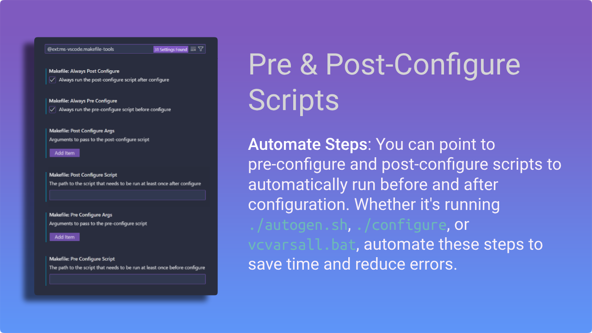
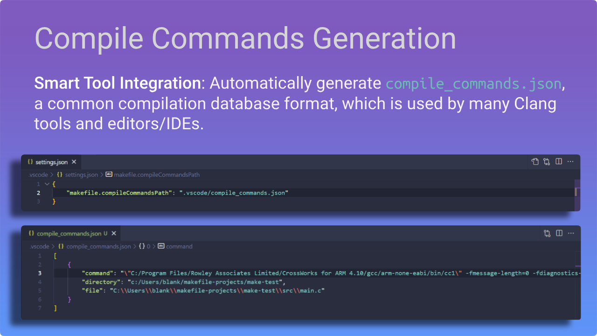

<h1 align=center>  Makefile Tools </h1>

<i>Enhancing Makefile development in VS Code.</i>

    
    
    
    

    
    
    

 

## Introduction

[Makefile Tools](https://marketplace.visualstudio.com/items?itemName=ms-vscode.makefile-tools) provides the native developer a full-featured, convenient, and powerful workflow for Makefile-based projects in Visual Studio Code. It enhances the development experience with pre and post-configuration script automation, allows for easy switching between multiple configurations, and supports rich IntelliSense features for Makefile. The customizable Project Outline view and environment variable management also simplifies the development experience. Additionally, it can generate a compilation database for integration with Clang tools and other editors/IDEs.

 Features

 

    
&nbsp;
    

    
&nbsp;
    

    
&nbsp;
    

## Getting Started

### Activating the extension
The extension will activate when it finds a Makefile in your `${workspaceFolder}`. If your Makefile does not
reside in the root of your folder, use the `makefile.makefilePath` (which generates the make switch -f)
or `makefile.makeDirectory` (which generates the make switch -C) settings to instruct the extension where to find it.

### Pre-configuring your project
If you need any environment variables to be set or any terminal operations to be run before configure/build
(like the usual `./autogen.sh`, `./configure` or `vcvarsall.bat`), you need to launch VSCode from a terminal
that is already set up according to your project requirements OR you can point the `makefile.preConfigureScript`
setting to a batch script file and invoke it at any time via the command `makefile.preconfigure` in the palette.
By setting `makefile.alwaysPreConfigure` to true, you don't need to run the pre-configure command separately.
The extension is going to invoke the script before every configure operation.

### Configuring your project
By default, the extension will attempt to use a `make` program that resides within your $PATH to configure
the project.  If you use a different flavor of the make tool or if it is not in your $PATH, use the
`makefile.makePath` setting to instruct the extension where to find it.  Provide a file/command that is in the
system path, prefixed with `${workspaceRoot}`, or an absolute path as relative paths will not be resolved
properly.

The extension can also avoid running the `make` program when it configures your project, if you point the
`makefile.buildLog` setting to the output of a build.

Now, you are ready to configure your project. If you normally just run `make` in the terminal to
configure/build your project, you shouldn't need to do anything else at this point besides accept the prompt
from [cpptools](https://marketplace.visualstudio.com/items?itemName=ms-vscode.cpptools) to allow this extension to configure IntelliSense:

If you don't see that message, or you accidentally dismissed it, you can grant Makefile Tools permission to
configure IntelliSense by running the `C/C++: Change Configuration Provider...` command and selecting Makefile
Tools from the list.

If you regularly pass additional arguments to `make`, you should use the `makefile.configurations` setting
to create a configuration object and specify the arguments to pass to `make` with the `makeArgs` property.
There are other options you can configure in this object as well. If you configure `make` in multiple
different ways, you can create multiple configuration objects with different arguments. Just make sure to
give your configurations a unique `name` so that you can tell them apart.

### Post-configuring your project
If you need any environment variables to be set, modified, or deleted, or any terminal operations to be run after configure/build,
you need to launch VSCode from a terminal that is already set up according to your project requirements OR
you can point the `makefile.postConfigureScript` setting to a batch script file and invoke it at any time via the
command `makefile.postConfigure` in the palette. By setting `makefile.alwaysPostConfigure` to true,
you don't need to run the post-configure command separately. The extension is going to invoke the script after every configure operation.

### Building targets

To build a target, run the `Makefile: Set the target to be built by make` command (default target is "all")
and then run the `Makefile: Build the current target`.  There are also convenience commands to build ALL,
build clean, etc. without having to change your active build target.

### Debugging and running targets

To Debug or run a target, run the `Makefile: Set the make launch configuration` command and select the target
you want to debug or run. If a configuration for that target has not already been added to the
`makefile.launchConfigurations` setting, then one will be added for you at this time.  Then run the 
`Makefile: Debug the selected binary target` or `Makefile: Run the selected binary target in the terminal` 
command to start debugging or running the target without a debugger attached.

If you need to pass additional arguments to your targets, update the `makefile.launchConfigurations` by adding
the `binaryArgs` property to the configuration.

## Resources
- [Makefile Settings](docs/makefile-settings.md) for command and variable substitutions.
- [Repositories](docs/repositories.md) to get the configurations for a select number of repositories that we have tested.
- [Troubleshooting](docs/troubleshooting.md) for reasons and workarounds for errors you might run into.
- [Github](https://github.com/microsoft/vscode-makefile-tools) for source code, issues, and contributing.

## Contributing

This project welcomes contributions and suggestions.  Most contributions require you to agree to a
Contributor License Agreement (CLA) declaring that you have the right to, and actually do, grant us
the rights to use your contribution. For details, visit https://cla.microsoft.com.

When you submit a pull request, a CLA-bot will automatically determine whether you need to provide
a CLA and decorate the PR appropriately (e.g., label, comment). Simply follow the instructions
provided by the bot. You will only need to do this once across all repos using our CLA.

You can file issues with us using one of our templates:

[Bug Report](https://github.com/microsoft/vscode-makefile-tools/issues/new?template=bugreport.yml): If you see an error message or encounter an issue while using the Makefile Tools extension.

[Feature Request](https://github.com/microsoft/vscode-makefile-tools/issues/new?template=featurerequest.yml): If you have a suggestion or need a feature that would enhance development.

[Documentation Request](https://github.com/microsoft/vscode-makefile-tools/issues/new?template=docrequest.yml): Requesting changes or additions to the Makefile Tools documentation.

##

### Microsoft Open Source Code of Conduct

This project has adopted the [Microsoft Open Source Code of Conduct](https://opensource.microsoft.com/codeofconduct/).
For more information see the [Code of Conduct FAQ](https://opensource.microsoft.com/codeofconduct/faq/) or
contact [opencode@microsoft.com](mailto:opencode@microsoft.com) with any additional questions or comments.

### Data and telemetry

This extension collects usage data and sends it to Microsoft to help improve our products and services. Collection of telemetry is controlled via the same setting provided by Visual Studio Code: `"telemetry.enableTelemetry"`. Read our [privacy statement](https://privacy.microsoft.com/en-us/privacystatement) to learn more.

### Contributors

